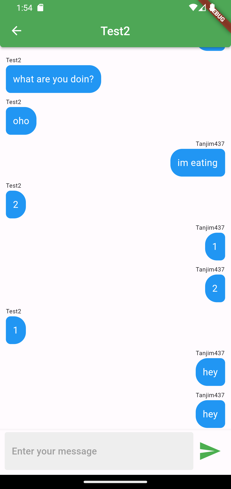
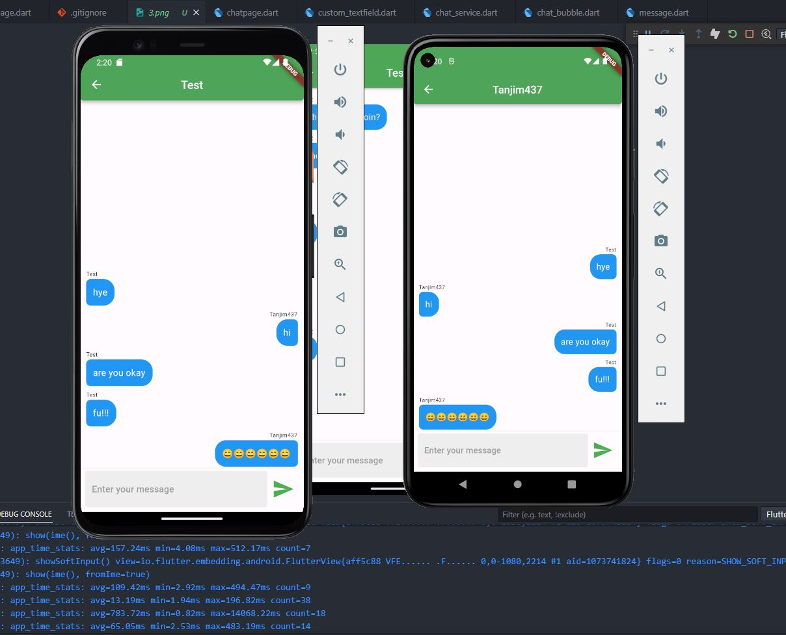

<h1 align="center" id="title">Chature - A simple Text Base app</h1>

Welcome to Chature - the app that proves you don't need to call to stay connected; texting is the new black! 📱💬 Ditch the phone calls and embrace the world of hassle-free witty and emoji-filled conversations. We're here to help you master the art of digital communication one message at a time. 📲😀 Whether you're discussing coding conundrums sharing funny memes or just keeping up with friends and family our Flutter-powered Firebase-fueled chat app will make sure your fingers never run out of things to type. It's like a never-ending game of digital charades! 🎮 So why wait? Start typing away because in our world texting is king. Plus it's less awkward than a voicemail. 🚀💬

<h2>Project Screenshots:</h2>

   

<h2>🚀 Demo</h2>

[Watch the Video](https://youtu.be/vuGF1sW_yiI)

<h2>🧐 Features</h2>

Here're some of the project's best features:

- Firebase Authetication
- Firebase Firestore

<h2>💻 Built with</h2>

Technologies used in the project:

- Firebase
- Firestore
- Flutter

<h2>💖Like my work?</h2>

Contact with me
https://t.me/tangim4103

